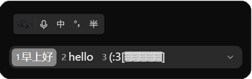
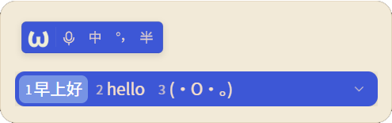

# DoubaoIME Darkmode

**Windows 豆包输入法** 主题修改工具，让输入法支持深色模式

豆包输入法语音识别功能非常好用，但windows版目前只提供了白色主题，对深色模式下打字输入不太友好，于是做了这个皮肤插件


---

## 功能

### 主题
#### Dark


#### Midlight


目前支持：

- 预设主题：Dark / Light / Midlight 
- 自定义主题颜色和字体颜色
- 候选栏字体修改
- 候选栏透明度调整
- 自定义工具栏头像

### 工具栏

目前输入法关闭悬浮工具栏后，似乎没有明显的打开入口
因此在插件的右键菜单中添加了：

- 输入法设置入口
- 工具栏开关


---

## 使用方法

启动后选择主题、字体、透明度或头像，然后安装生效

需要恢复官方皮肤时，点击卸载即可从安装主题时创建的备份恢复原始文件

> 安装或卸载主题时程序需要修改：`C:\Program Files\DoubaoIME` 因此会请求管理员权限


---

## 原理

插件会读取本机输入法 `skin/default` 中的原始 SVG / XML / PNG 资源，根据用户选择的颜色、字体、透明度和头像生成新的皮肤文件，然后写回对应目录

### 文件位置

插件的配置文件保存在：

```text
C:\tmp\DoubaoIME Darkmode\
```

主要包括：

```text
DoubaoIME Darkmode.json
DoubaoIME Darkmode.json.bak
logo.png
webview\
```

其中 `logo.png` 仅在使用自定义工具栏头像时存在

豆包输入法原始皮肤文件的备份保存在对应版本的：

```text
skin\default\dmdm_backup\
```

卸载主题时会使用这里的文件恢复官方皮肤，请谨慎删除

### 兼容性

当前测试兼容 `v0.9.0.0`

> 官方更新可能改变皮肤结构，程序启动时会检查输入法的目录结构；
> 如果检测到当前输入法结构与已验证版本不一致，会提示可能不兼容，并阻止直接安装主题；
> 版本未验证但结构一致时，可尝试安装；


---

## 声明

本项目为独立的第三方小工具，不是官方插件，也不代表官方支持

仓库不包含豆包输入法官方 SVG / XML / PNG 皮肤资源及其修改版本 

所有主题文件均在点击「安装」时，根据本机已安装的输入法资源即时生成，不携带或分发官方皮肤文件

本仓库以 MIT License 发布，详见 [LICENSE](LICENSE)。
